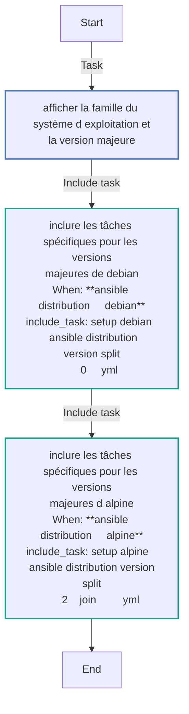
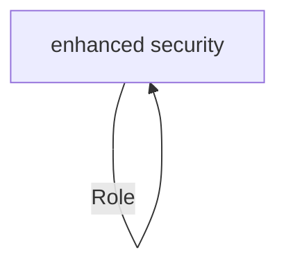

<!-- DOCSIBLE START -->

# 📃 Role overview

## enhanced-security


Description: your role description


| Field                | Value           |
|--------------------- |-----------------|
| Readme update        | 04/02/2025 |


### Vars

**These are variables with higher priority**
#### File: vars/main.yml

| Var          | Type         | Value       |Required    | Title       |
|--------------|--------------|-------------|-------------|-------------|
| [disable_kernel_modules](vars/main.yml#L3)   | dict   | `{'disable_cramfs': True, 'disable_squashfs': True, 'disable_hfs': True, 'disable_hfsplus': True, 'disable_udf': True, 'disable_jffs2': True, 'disable_freevxfs': True}` |    n/a  |  n/a |
| [cron_permissions](vars/main.yml#L13)   | bool   | `True` |    n/a  |  n/a |


### Tasks


#### File: tasks/setup-Debian-12.yml

| Name | Module | Has Conditions |
| ---- | ------ | --------- |
| Unnamed_block | block | False |
| Check if blacklist.conf exists | stat | False |
| Create blacklist.conf if it does not exist | template | True |
| Unnamed_block | block | True |
| Create cramfs.conf | template | True |
| blacklisted cramfs | ansible.builtin.lineinfile | True |
| Unnamed_block | block | True |
| Create freevxfs.conf | template | True |
| blacklisted freevxfs | ansible.builtin.lineinfile | True |
| Unnamed_block | block | False |
| Create hfs.conf | template | True |
| blacklisted hfs | ansible.builtin.lineinfile | True |
| Unnamed_block | block | True |
| Create hfsplus.conf | template | True |
| blacklisted hfsplus | ansible.builtin.lineinfile | True |
| Unnamed_block | block | True |
| Create jffs2.conf | template | True |
| blacklisted jffs2 | ansible.builtin.lineinfile | True |
| Unnamed_block | block | True |
| Create squashfs.conf | template | True |
| blacklisted squashfs | ansible.builtin.lineinfile | True |
| Unnamed_block | block | True |
| Create udf.conf | template | True |
| blacklisted udf | ansible.builtin.lineinfile | True |
| Unnamed_block | block | False |
| Modify /etc/crontab permissions if necessary | ansible.builtin.file | True |
| Modify /etc/cron.hourly permissions if necessary | ansible.builtin.file | True |
| Modify /etc/cron.daily permissions if necessary | ansible.builtin.file | True |
| Modify /etc/cron.weekly permissions if necessary | ansible.builtin.file | True |
| Modify /etc/cron.monthly permissions if necessary | ansible.builtin.file | True |
| Modify /etc/cron.d permissions if necessary | ansible.builtin.file | True |
| Modify /etc/cron.allow permissions if necessary | ansible.builtin.file | True |

#### File: tasks/main.yml

| Name | Module | Has Conditions |
| ---- | ------ | --------- |
| Afficher la famille du système d'exploitation et la version majeure | debug | False |
| Inclure les tâches spécifiques pour les versions majeures de Debian | include_tasks | True |
| Inclure les tâches spécifiques pour les versions majeures d'Alpine | include_tasks | True |


## Task Flow Graphs


### Graph for setup-Debian-12.yml

```mermaid
flowchart TD
Start
classDef block stroke:#3498db,stroke-width:2px;
classDef task stroke:#4b76bb,stroke-width:2px;
classDef includeTasks stroke:#16a085,stroke-width:2px;
classDef importTasks stroke:#34495e,stroke-width:2px;
classDef includeRole stroke:#2980b9,stroke-width:2px;
classDef importRole stroke:#699ba7,stroke-width:2px;
classDef includeVars stroke:#8e44ad,stroke-width:2px;
classDef rescue stroke:#665352,stroke-width:2px;

  Start-->|Block Start| Unnamed_task_00_block_start_0[[unnamed task 0]]:::block
  Unnamed_task_00_block_start_0-->|Task| Check_if_blacklist_conf_exists0[check if blacklist conf exists]:::task
  Check_if_blacklist_conf_exists0-->|Task| Create_blacklist_conf_if_it_does_not_exist1[create blacklist conf if it does not exist<br>When: **not blacklist file stat exists**]:::task
  Create_blacklist_conf_if_it_does_not_exist1-->|Block Start| Unnamed_task_22_block_start_1[[unnamed task 2<br>When: **disable kernel modules disable cramfs    true**]]:::block
  Unnamed_task_22_block_start_1-->|Task| Create_cramfs_conf0[create cramfs conf<br>When: **disable kernel modules disable cramfs    true**]:::task
  Create_cramfs_conf0-->|Task| blacklisted_cramfs1[blacklisted cramfs<br>When: **disable kernel modules disable cramfs    true**]:::task
  blacklisted_cramfs1-.->|End of Block| Unnamed_task_22_block_start_1
  blacklisted_cramfs1-->|Block Start| Unnamed_task_33_block_start_1[[unnamed task 3<br>When: **disable kernel modules disable freevxfs    true**]]:::block
  Unnamed_task_33_block_start_1-->|Task| Create_freevxfs_conf0[create freevxfs conf<br>When: **disable kernel modules disable freevxfs    true**]:::task
  Create_freevxfs_conf0-->|Task| blacklisted_freevxfs1[blacklisted freevxfs<br>When: **disable kernel modules disable freevxfs    true**]:::task
  blacklisted_freevxfs1-.->|End of Block| Unnamed_task_33_block_start_1
  blacklisted_freevxfs1-->|Block Start| Unnamed_task_44_block_start_1[[unnamed task 4]]:::block
  Unnamed_task_44_block_start_1-->|Task| Create_hfs_conf0[create hfs conf<br>When: **disable kernel modules disable hfs    true**]:::task
  Create_hfs_conf0-->|Task| blacklisted_hfs1[blacklisted hfs<br>When: **disable kernel modules disable hfs    true**]:::task
  blacklisted_hfs1-.->|End of Block| Unnamed_task_44_block_start_1
  blacklisted_hfs1-->|Block Start| Unnamed_task_55_block_start_1[[unnamed task 5<br>When: **disable kernel modules disable hfsplus    true**]]:::block
  Unnamed_task_55_block_start_1-->|Task| Create_hfsplus_conf0[create hfsplus conf<br>When: **disable kernel modules disable hfsplus    true**]:::task
  Create_hfsplus_conf0-->|Task| blacklisted_hfsplus1[blacklisted hfsplus<br>When: **disable kernel modules disable hfsplus    true**]:::task
  blacklisted_hfsplus1-.->|End of Block| Unnamed_task_55_block_start_1
  blacklisted_hfsplus1-->|Block Start| Unnamed_task_66_block_start_1[[unnamed task 6<br>When: **disable kernel modules disable jffs2    true**]]:::block
  Unnamed_task_66_block_start_1-->|Task| Create_jffs2_conf0[create jffs2 conf<br>When: **disable kernel modules disable jffs2    true**]:::task
  Create_jffs2_conf0-->|Task| blacklisted_jffs21[blacklisted jffs2<br>When: **disable kernel modules disable jffs2    true**]:::task
  blacklisted_jffs21-.->|End of Block| Unnamed_task_66_block_start_1
  blacklisted_jffs21-->|Block Start| Unnamed_task_77_block_start_1[[unnamed task 7<br>When: **disable kernel modules disable squashfs    true**]]:::block
  Unnamed_task_77_block_start_1-->|Task| Create_squashfs_conf0[create squashfs conf<br>When: **disable kernel modules disable squashfs    true**]:::task
  Create_squashfs_conf0-->|Task| blacklisted_squashfs1[blacklisted squashfs<br>When: **disable kernel modules disable squashfs    true**]:::task
  blacklisted_squashfs1-.->|End of Block| Unnamed_task_77_block_start_1
  blacklisted_squashfs1-->|Block Start| Unnamed_task_88_block_start_1[[unnamed task 8<br>When: **disable kernel modules disable udf    true**]]:::block
  Unnamed_task_88_block_start_1-->|Task| Create_udf_conf0[create udf conf<br>When: **disable kernel modules disable udf    true**]:::task
  Create_udf_conf0-->|Task| blacklisted_udf1[blacklisted udf<br>When: **disable kernel modules disable udf    true**]:::task
  blacklisted_udf1-.->|End of Block| Unnamed_task_88_block_start_1
  blacklisted_udf1-.->|End of Block| Unnamed_task_00_block_start_0
  blacklisted_udf1-->|Block Start| Unnamed_task_11_block_start_0[[unnamed task 1]]:::block
  Unnamed_task_11_block_start_0-->|Task| Modify__etc_crontab_permissions_if_necessary0[modify  etc crontab permissions if necessary<br>When: **cron permissions    true**]:::task
  Modify__etc_crontab_permissions_if_necessary0-->|Task| Modify__etc_cron_hourly_permissions_if_necessary1[modify  etc cron hourly permissions if necessary<br>When: **cron permissions    true**]:::task
  Modify__etc_cron_hourly_permissions_if_necessary1-->|Task| Modify__etc_cron_daily_permissions_if_necessary2[modify  etc cron daily permissions if necessary<br>When: **cron permissions    true**]:::task
  Modify__etc_cron_daily_permissions_if_necessary2-->|Task| Modify__etc_cron_weekly_permissions_if_necessary3[modify  etc cron weekly permissions if necessary<br>When: **cron permissions    true**]:::task
  Modify__etc_cron_weekly_permissions_if_necessary3-->|Task| Modify__etc_cron_monthly_permissions_if_necessary4[modify  etc cron monthly permissions if necessary<br>When: **cron permissions    true**]:::task
  Modify__etc_cron_monthly_permissions_if_necessary4-->|Task| Modify__etc_cron_d_permissions_if_necessary5[modify  etc cron d permissions if necessary<br>When: **cron permissions    true**]:::task
  Modify__etc_cron_d_permissions_if_necessary5-->|Task| Modify__etc_cron_allow_permissions_if_necessary6[modify  etc cron allow permissions if necessary<br>When: **cron permissions    true**]:::task
  Modify__etc_cron_allow_permissions_if_necessary6-.->|End of Block| Unnamed_task_11_block_start_0
  Modify__etc_cron_allow_permissions_if_necessary6-->End
```




### Graph for main.yml




## Playbook

```yml
---
- hosts: enhanced-security
  become: yes
  roles:
    - enhanced-security

```
## Playbook graph


## Author Information
your name

#### License

license (GPL-2.0-or-later, MIT, etc)

#### Minimum Ansible Version

2.1

#### Platforms

No platforms specified.
<!-- DOCSIBLE END -->