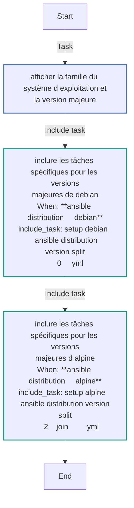
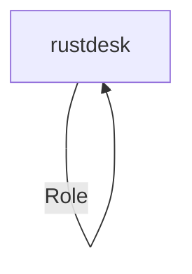

<!-- DOCSIBLE START -->

# 📃 Role overview

## rustdesk


Description: your role description


| Field                | Value           |
|--------------------- |-----------------|
| Readme update        | 04/02/2025 |


### Tasks


#### File: tasks/setup-Alpine-3.19.yml

| Name | Module | Has Conditions |
| ---- | ------ | --------- |
| Installation des PAQUETS | community.general.apk | True |
| RUSTDESK - Regle du par feu | block | False |
| Allow port 22 | community.general.ufw | False |
| Allow port range 21115:21119 | community.general.ufw | False |
| Allow port 8000 | community.general.ufw | False |
| Allow port 21116 | community.general.ufw | False |
| Créer le groupe rustdesk si inexistant | group | False |
| Créer l'utilisateur rustdesk | ansible.builtin.user | False |
| Créer les répertoires nécessaires | ansible.builtin.file | False |
| Télécharger et extraire rustdesk-server | ansible.builtin.get_url | False |
| Décompresser rustdesk-server | unarchive | False |
| Déplacer les exécutables vers /usr/bin | copy | False |
| RUSTDESK - copie des services rustdesk | block | True |
| RUSTDESK - Création des service Rustdesk | ansible.builtin.template | False |
| Ajouter hbbs à rc-update | ansible.builtin.command | False |
| Ajouter hbbr à rc-update | ansible.builtin.command | False |
| Vérifier le répertoire /var/lib/rustdesk | stat | False |
| Afficher la clé publique ID_ED25519 | command | False |
| Afficher la clé publique | debug | False |

#### File: tasks/setup-Alpine-3.20.yml

| Name | Module | Has Conditions |
| ---- | ------ | --------- |
| Installation des PAQUETS | community.general.apk | True |
| RUSTDESK - Regle du par feu | block | False |
| Allow port 22 | community.general.ufw | False |
| Allow port range 21115:21119 | community.general.ufw | False |
| Allow port 8000 | community.general.ufw | False |
| Allow port 21116 | community.general.ufw | False |
| Créer le groupe rustdesk si inexistant | group | False |
| Créer l'utilisateur rustdesk | ansible.builtin.user | False |
| Créer les répertoires nécessaires | ansible.builtin.file | False |
| Télécharger et extraire rustdesk-server | ansible.builtin.get_url | False |
| Décompresser rustdesk-server | unarchive | False |
| Déplacer les exécutables vers /usr/bin | copy | False |
| RUSTDESK - copie des services rustdesk | block | True |
| RUSTDESK - Création des service Rustdesk | ansible.builtin.template | False |
| Ajouter hbbs à rc-update | ansible.builtin.command | False |
| Ajouter hbbr à rc-update | ansible.builtin.command | False |
| Vérifier le répertoire /var/lib/rustdesk | stat | False |
| Afficher la clé publique ID_ED25519 | command | False |
| Afficher la clé publique | debug | False |

#### File: tasks/setup-Alpine-3.18.yml

| Name | Module | Has Conditions |
| ---- | ------ | --------- |
| Installation des PAQUETS | community.general.apk | True |
| RUSTDESK - Regle du par feu | block | False |
| Allow port 22 | community.general.ufw | False |
| Allow port range 21115:21119 | community.general.ufw | False |
| Allow port 8000 | community.general.ufw | False |
| Allow port 21116 | community.general.ufw | False |
| Créer le groupe rustdesk si inexistant | group | False |
| Créer l'utilisateur rustdesk | ansible.builtin.user | False |
| Créer les répertoires nécessaires | ansible.builtin.file | False |
| Télécharger et extraire rustdesk-server | ansible.builtin.get_url | False |
| Décompresser rustdesk-server | unarchive | False |
| Déplacer les exécutables vers /usr/bin | copy | False |
| RUSTDESK - copie des services rustdesk | block | True |
| RUSTDESK - Création des service Rustdesk | ansible.builtin.template | False |
| Ajouter hbbs à rc-update | ansible.builtin.command | False |
| Ajouter hbbr à rc-update | ansible.builtin.command | False |
| Vérifier le répertoire /var/lib/rustdesk | stat | False |
| Afficher la clé publique ID_ED25519 | command | False |
| Afficher la clé publique | debug | False |

#### File: tasks/main.yml

| Name | Module | Has Conditions |
| ---- | ------ | --------- |
| Afficher la famille du système d'exploitation et la version majeure | debug | False |
| Inclure les tâches spécifiques pour les versions majeures de Debian | include_tasks | True |
| Inclure les tâches spécifiques pour les versions majeures d'Alpine | include_tasks | True |


## Task Flow Graphs


### Graph for setup-Alpine-3.19.yml




### Graph for setup-Alpine-3.20.yml


### Graph for setup-Alpine-3.18.yml

```mermaid
flowchart TD
Start
classDef block stroke:#3498db,stroke-width:2px;
classDef task stroke:#4b76bb,stroke-width:2px;
classDef includeTasks stroke:#16a085,stroke-width:2px;
classDef importTasks stroke:#34495e,stroke-width:2px;
classDef includeRole stroke:#2980b9,stroke-width:2px;
classDef importRole stroke:#699ba7,stroke-width:2px;
classDef includeVars stroke:#8e44ad,stroke-width:2px;
classDef rescue stroke:#665352,stroke-width:2px;

  Start-->|Task| Installation_des_PAQUETS0[installation des paquets<br>When: **ansible distribution     alpine**]:::task
  Installation_des_PAQUETS0-->|Block Start| RUSTDESK___Regle_du_par_feu1_block_start_0[[rustdesk   regle du par feu]]:::block
  RUSTDESK___Regle_du_par_feu1_block_start_0-->|Task| Allow_port_220[allow port 22]:::task
  Allow_port_220-->|Task| Allow_port_range_21115_211191[allow port range 21115 21119]:::task
  Allow_port_range_21115_211191-->|Task| Allow_port_80002[allow port 8000]:::task
  Allow_port_80002-->|Task| Allow_port_211163[allow port 21116]:::task
  Allow_port_211163-.->|End of Block| RUSTDESK___Regle_du_par_feu1_block_start_0
  Allow_port_211163-->|Task| Créer_le_groupe_rustdesk_si_inexistant2[créer le groupe rustdesk si inexistant]:::task
  Créer_le_groupe_rustdesk_si_inexistant2-->|Task| Créer_l_utilisateur_rustdesk3[créer l utilisateur rustdesk]:::task
  Créer_l_utilisateur_rustdesk3-->|Task| Créer_les_répertoires_nécessaires4[créer les répertoires nécessaires]:::task
  Créer_les_répertoires_nécessaires4-->|Task| Télécharger_et_extraire_rustdesk_server5[télécharger et extraire rustdesk server]:::task
  Télécharger_et_extraire_rustdesk_server5-->|Task| Décompresser_rustdesk_server6[décompresser rustdesk server]:::task
  Décompresser_rustdesk_server6-->|Task| Déplacer_les_exécutables_vers__usr_bin7[déplacer les exécutables vers  usr bin]:::task
  Déplacer_les_exécutables_vers__usr_bin7-->|Block Start| RUSTDESK___copie_des_services_rustdesk8_block_start_0[[rustdesk   copie des services rustdesk<br>When: **ansible distribution     alpine**]]:::block
  RUSTDESK___copie_des_services_rustdesk8_block_start_0-->|Task| RUSTDESK___Création_des_service_Rustdesk0[rustdesk   création des service rustdesk]:::task
  RUSTDESK___Création_des_service_Rustdesk0-->|Task| Ajouter_hbbs_à_rc_update1[ajouter hbbs à rc update]:::task
  Ajouter_hbbs_à_rc_update1-->|Task| Ajouter_hbbr_à_rc_update2[ajouter hbbr à rc update]:::task
  Ajouter_hbbr_à_rc_update2-.->|End of Block| RUSTDESK___copie_des_services_rustdesk8_block_start_0
  Ajouter_hbbr_à_rc_update2-->|Task| Vérifier_le_répertoire__var_lib_rustdesk9[vérifier le répertoire  var lib rustdesk]:::task
  Vérifier_le_répertoire__var_lib_rustdesk9-->|Task| Afficher_la_clé_publique_ID_ED2551910[afficher la clé publique id ed25519]:::task
  Afficher_la_clé_publique_ID_ED2551910-->|Task| Afficher_la_clé_publique11[afficher la clé publique]:::task
  Afficher_la_clé_publique11-->End
```


### Graph for main.yml




## Playbook

```yml
---
- hosts: rustdesk
  become: yes
  roles:
    - rustdesk

```
## Playbook graph


## Author Information
your name

#### License

license (GPL-2.0-or-later, MIT, etc)

#### Minimum Ansible Version

2.1

#### Platforms

No platforms specified.
<!-- DOCSIBLE END -->