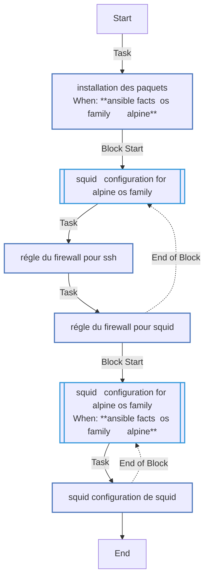
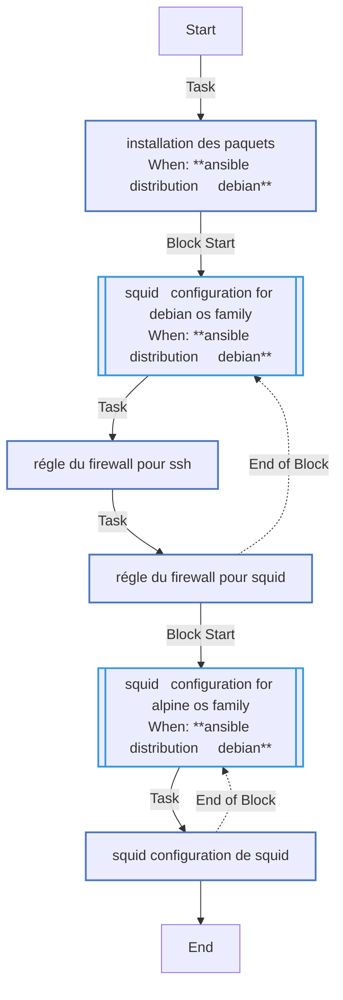
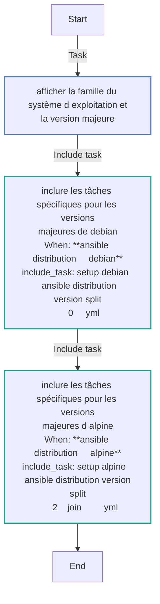
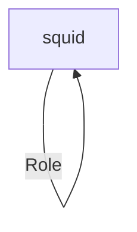

<!-- DOCSIBLE START -->

# 📃 Role overview

## squid


Description: your role description


| Field                | Value           |
|--------------------- |-----------------|
| Readme update        | 04/02/2025 |


### Tasks


#### File: tasks/setup-Alpine-3.19.yml

| Name | Module | Has Conditions |
| ---- | ------ | --------- |
| Installation des PAQUETS | community.general.apk | True |
| SQUID - configuration for Alpine os family | block | False |
| Régle du Firewall pour ssh | community.general.ufw | False |
| Régle du Firewall pour squid | community.general.ufw | False |
| SQUID - configuration for Alpine os family | block | True |
| SQUID - Configuration de squid | ansible.builtin.template | False |

#### File: tasks/setup-Alpine-3.20.yml

| Name | Module | Has Conditions |
| ---- | ------ | --------- |
| Installation des PAQUETS | community.general.apk | True |
| SQUID - configuration for Alpine os family | block | False |
| Régle du Firewall pour ssh | community.general.ufw | False |
| Régle du Firewall pour squid | community.general.ufw | False |
| SQUID - configuration for Alpine os family | block | True |
| SQUID - Configuration de squid | ansible.builtin.template | False |

#### File: tasks/setup-Debian-12.yml

| Name | Module | Has Conditions |
| ---- | ------ | --------- |
| Installation des PAQUETS | ansible.builtin.apt | True |
| SQUID - configuration for Debian os family | block | True |
| Régle du Firewall pour ssh | community.general.ufw | False |
| Régle du Firewall pour squid | community.general.ufw | False |
| SQUID - configuration for Alpine os family | block | True |
| SQUID - Configuration de squid | ansible.builtin.template | False |

#### File: tasks/setup-Alpine-3.18.yml

| Name | Module | Has Conditions |
| ---- | ------ | --------- |
| Installation des PAQUETS | community.general.apk | True |
| SQUID - configuration for Alpine os family | block | False |
| Régle du Firewall pour ssh | community.general.ufw | False |
| Régle du Firewall pour squid | community.general.ufw | False |
| SQUID - configuration for Alpine os family | block | True |
| SQUID - Configuration de squid | ansible.builtin.template | False |

#### File: tasks/main.yml

| Name | Module | Has Conditions |
| ---- | ------ | --------- |
| Afficher la famille du système d'exploitation et la version majeure | debug | False |
| Inclure les tâches spécifiques pour les versions majeures de Debian | include_tasks | True |
| Inclure les tâches spécifiques pour les versions majeures d'Alpine | include_tasks | True |


## Task Flow Graphs


### Graph for setup-Alpine-3.19.yml




### Graph for setup-Alpine-3.20.yml


### Graph for setup-Debian-12.yml




### Graph for setup-Alpine-3.18.yml


### Graph for main.yml




## Playbook

```yml
# playbooks/squid.yml
---
- hosts: squid
  become: yes
  roles:
    - squid
```
## Playbook graph


## Author Information
your name

#### License

license (GPL-2.0-or-later, MIT, etc)

#### Minimum Ansible Version

2.1

#### Platforms

No platforms specified.
<!-- DOCSIBLE END -->