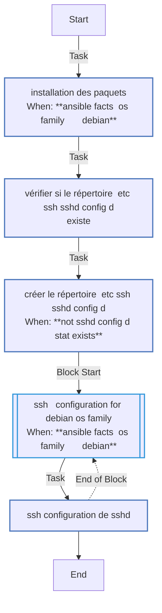
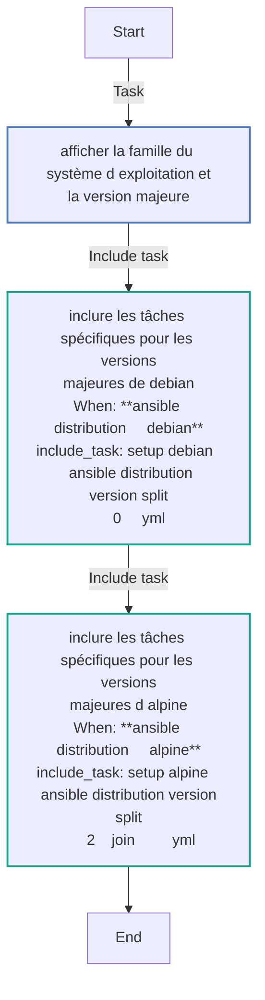
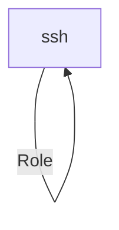

<!-- DOCSIBLE START -->

# 📃 Role overview

## ssh


Description: your role description


| Field                | Value           |
|--------------------- |-----------------|
| Readme update        | 04/02/2025 |


### Vars

**These are variables with higher priority**
#### File: vars/main.yml

| Var          | Type         | Value       |Required    | Title       |
|--------------|--------------|-------------|-------------|-------------|
| [ssh_allowed_users](vars/main.yml#L3)   | list   | `['sysadmin', 'medaey']` |    n/a  |  n/a |


### Tasks


#### File: tasks/setup-Alpine-3.19.yml

| Name | Module | Has Conditions |
| ---- | ------ | --------- |
| Installation des PAQUETS | community.general.apk | True |
| Vérifier si le répertoire /etc/ssh/sshd_config.d existe | stat | False |
| Créer le répertoire /etc/ssh/sshd_config.d | file | True |
| SSH - Importation des configuration | block | False |
| SSH - Configuration de sshd | ansible.builtin.template | False |
| Commenter la ligne GSSAPIAuthentication pour Alpine Linux | lineinfile | True |
| Commenter la ligne GSSAPIKeyExchange pour Alpine Linux | lineinfile | True |
| Commenter la ligne KerberosAuthentication pour Alpine Linux | lineinfile | True |
| Commenter la ligne PrintLastLog pour Alpine Linux | lineinfile | True |

#### File: tasks/setup-Alpine-3.20.yml

| Name | Module | Has Conditions |
| ---- | ------ | --------- |
| Installation des PAQUETS | community.general.apk | True |
| Vérifier si le répertoire /etc/ssh/sshd_config.d existe | stat | False |
| Créer le répertoire /etc/ssh/sshd_config.d | file | True |
| SSH - Importation des configuration | block | False |
| SSH - Configuration de sshd | ansible.builtin.template | False |
| Commenter la ligne GSSAPIAuthentication pour Alpine Linux | lineinfile | True |
| Commenter la ligne GSSAPIKeyExchange pour Alpine Linux | lineinfile | True |
| Commenter la ligne KerberosAuthentication pour Alpine Linux | lineinfile | True |
| Commenter la ligne PrintLastLog pour Alpine Linux | lineinfile | True |

#### File: tasks/setup-Debian-12.yml

| Name | Module | Has Conditions |
| ---- | ------ | --------- |
| Installation des PAQUETS | ansible.builtin.apt | True |
| Vérifier si le répertoire /etc/ssh/sshd_config.d existe | stat | False |
| Créer le répertoire /etc/ssh/sshd_config.d | file | True |
| SSH - configuration for Debian os family | block | True |
| SSH - Configuration de sshd | ansible.builtin.template | False |

#### File: tasks/setup-Alpine-3.21.yml

| Name | Module | Has Conditions |
| ---- | ------ | --------- |
| Installation des PAQUETS | community.general.apk | True |
| Vérifier si le répertoire /etc/ssh/sshd_config.d existe | stat | False |
| Créer le répertoire /etc/ssh/sshd_config.d | file | True |
| SSH - Importation des configuration | block | False |
| SSH - Configuration de sshd | ansible.builtin.template | False |
| Commenter la ligne GSSAPIAuthentication pour Alpine Linux | lineinfile | True |
| Commenter la ligne GSSAPIKeyExchange pour Alpine Linux | lineinfile | True |
| Commenter la ligne KerberosAuthentication pour Alpine Linux | lineinfile | True |
| Commenter la ligne PrintLastLog pour Alpine Linux | lineinfile | True |

#### File: tasks/setup-Alpine-3.18.yml

| Name | Module | Has Conditions |
| ---- | ------ | --------- |
| Installation des PAQUETS | community.general.apk | True |
| Vérifier si le répertoire /etc/ssh/sshd_config.d existe | stat | False |
| Créer le répertoire /etc/ssh/sshd_config.d | file | True |
| SSH - Importation des configuration | block | False |
| SSH - Configuration de sshd | ansible.builtin.template | False |
| Commenter la ligne GSSAPIAuthentication pour Alpine Linux | lineinfile | True |
| Commenter la ligne GSSAPIKeyExchange pour Alpine Linux | lineinfile | True |
| Commenter la ligne KerberosAuthentication pour Alpine Linux | lineinfile | True |
| Commenter la ligne PrintLastLog pour Alpine Linux | lineinfile | True |

#### File: tasks/main.yml

| Name | Module | Has Conditions |
| ---- | ------ | --------- |
| Afficher la famille du système d'exploitation et la version majeure | debug | False |
| Inclure les tâches spécifiques pour les versions majeures de Debian | include_tasks | True |
| Inclure les tâches spécifiques pour les versions majeures d'Alpine | include_tasks | True |


## Task Flow Graphs


### Graph for setup-Alpine-3.19.yml




### Graph for setup-Alpine-3.20.yml


### Graph for setup-Debian-12.yml




### Graph for setup-Alpine-3.21.yml


### Graph for setup-Alpine-3.18.yml

```mermaid
flowchart TD
Start
classDef block stroke:#3498db,stroke-width:2px;
classDef task stroke:#4b76bb,stroke-width:2px;
classDef includeTasks stroke:#16a085,stroke-width:2px;
classDef importTasks stroke:#34495e,stroke-width:2px;
classDef includeRole stroke:#2980b9,stroke-width:2px;
classDef importRole stroke:#699ba7,stroke-width:2px;
classDef includeVars stroke:#8e44ad,stroke-width:2px;
classDef rescue stroke:#665352,stroke-width:2px;

  Start-->|Task| Installation_des_PAQUETS0[installation des paquets<br>When: **ansible distribution     alpine**]:::task
  Installation_des_PAQUETS0-->|Task| Vérifier_si_le_répertoire__etc_ssh_sshd_config_d_existe1[vérifier si le répertoire  etc ssh sshd config d<br>existe]:::task
  Vérifier_si_le_répertoire__etc_ssh_sshd_config_d_existe1-->|Task| Créer_le_répertoire__etc_ssh_sshd_config_d2[créer le répertoire  etc ssh sshd config d<br>When: **not sshd config d stat exists**]:::task
  Créer_le_répertoire__etc_ssh_sshd_config_d2-->|Block Start| SSH___Importation_des_configuration3_block_start_0[[ssh   importation des configuration]]:::block
  SSH___Importation_des_configuration3_block_start_0-->|Task| SSH___Configuration_de_sshd0[ssh   configuration de sshd]:::task
  SSH___Configuration_de_sshd0-.->|End of Block| SSH___Importation_des_configuration3_block_start_0
  SSH___Configuration_de_sshd0-->|Task| Commenter_la_ligne_GSSAPIAuthentication_pour_Alpine_Linux4[commenter la ligne gssapiauthentication pour<br>alpine linux<br>When: **ansible distribution     alpine**]:::task
  Commenter_la_ligne_GSSAPIAuthentication_pour_Alpine_Linux4-->|Task| Commenter_la_ligne_GSSAPIKeyExchange_pour_Alpine_Linux5[commenter la ligne gssapikeyexchange pour alpine<br>linux<br>When: **ansible distribution     alpine**]:::task
  Commenter_la_ligne_GSSAPIKeyExchange_pour_Alpine_Linux5-->|Task| Commenter_la_ligne_KerberosAuthentication_pour_Alpine_Linux6[commenter la ligne kerberosauthentication pour<br>alpine linux<br>When: **ansible distribution     alpine**]:::task
  Commenter_la_ligne_KerberosAuthentication_pour_Alpine_Linux6-->|Task| Commenter_la_ligne_PrintLastLog_pour_Alpine_Linux7[commenter la ligne printlastlog pour alpine linux<br>When: **ansible distribution     alpine**]:::task
  Commenter_la_ligne_PrintLastLog_pour_Alpine_Linux7-->End
```


### Graph for main.yml




## Playbook

```yml
# playbooks/ssh.yml
---
- name: Obtenir l'IP publique sur localhost
  import_playbook: get_public_ip.yml

- name: Configurer SSH sur les serveurs distants
  hosts: ssh 
  become: yes
  gather_facts: true
  
  roles:
    - ssh

```
## Playbook graph


## Author Information
your name

#### License

license (GPL-2.0-or-later, MIT, etc)

#### Minimum Ansible Version

2.1

#### Platforms

No platforms specified.
<!-- DOCSIBLE END -->